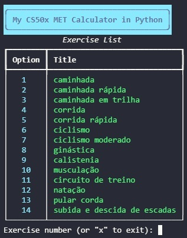
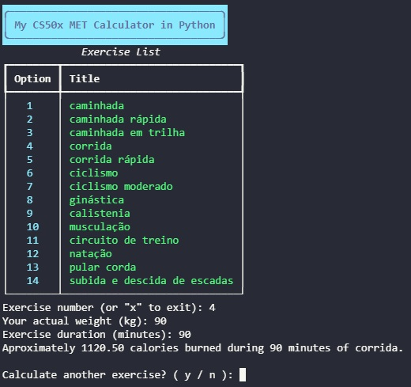

Harvard's CS50P Python course Final Project 2025 / 2026.

#My Calories Burn Calculator in Python

###Video Demo: https://youtu.be/8cLBtHgT1RQ

###Description:
A command-line interface (CLI) application built with Python that helps users calculate their caloric expenditure based on the MET (Metabolic Equivalent of Task) concept. The application features a stylized terminal UI using the Rich library, allowing users to select exercises from an list, input their physical data, and maintain a history of their activities in a log file.

###Features
- Stylized Interface: Uses Rich for beautiful tables, panels, and colors.

- Dynamic Exercise Selection: Users can select exercises by number from an organized list.

- Accurate Calculations: Implements standard MET formulas for calorie burning.

- Persistent Logging: Automatically saves every calculation to a log.txt file with timestamps.

###Project Structure
- project.py: The main script containing the program logic and the three required functions: verify_met, calculate_calories, and save_log.

- test_project.py: The test suite containing pytest functions to ensure the reliability of the core logic.

- requirements.txt: List of external dependencies (rich, pytest).

- log.txt: A text file generated by the application to store user history.

###Screenshots

--------------------------------------------------

Main menu showing the list of available exercises.

-------------------------------------------

Successful calorie calculation and summary.

